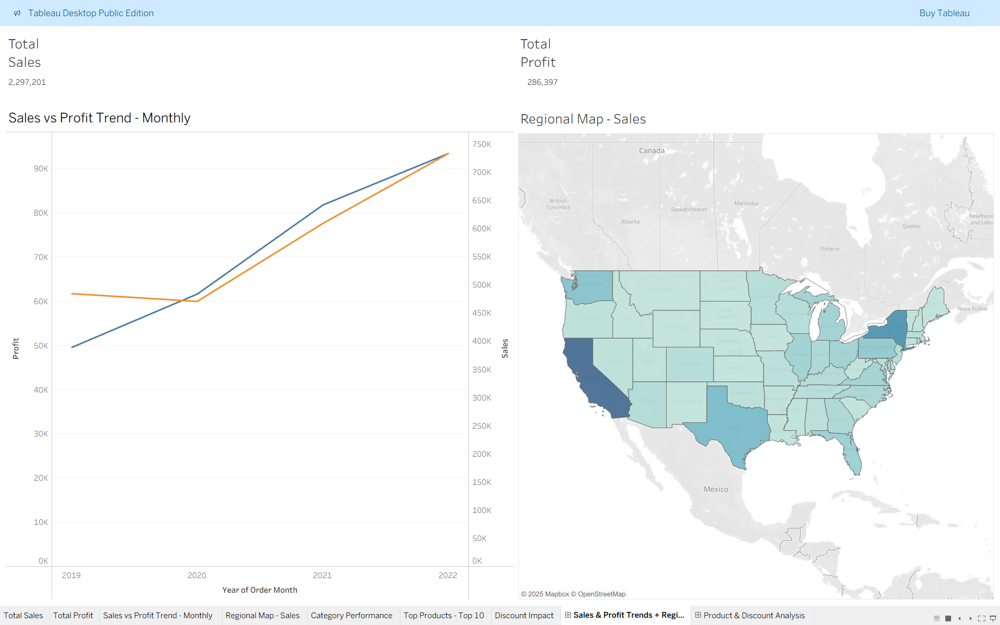
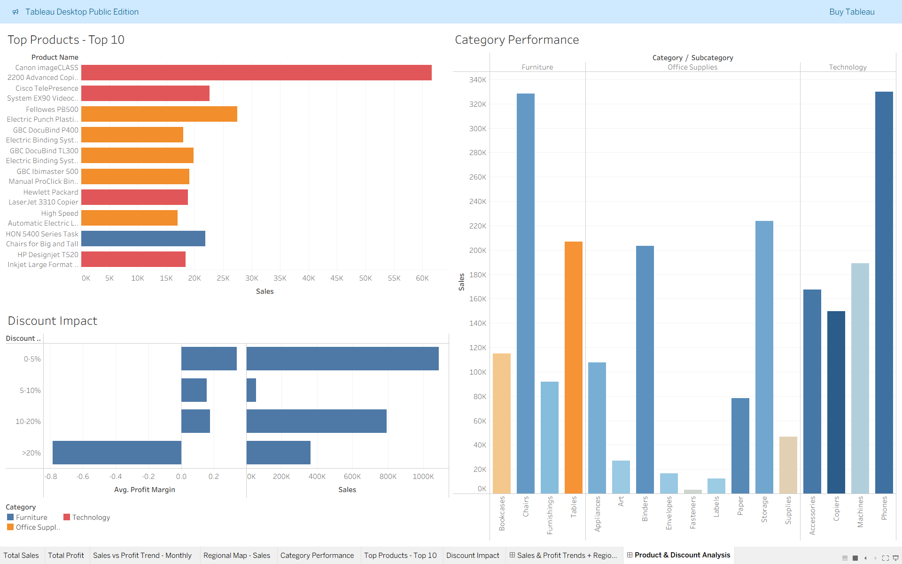

# 📊 Superstore Sales Analysis (2019–2022) – Tableau Project

## 🔹 Project Overview
This project analyzes the **Superstore dataset (2019–2022)** from Kaggle using **Tableau**. The goal was to uncover actionable insights into **sales, profit, product performance, discount impact, and regional trends** to support data-driven business decisions.  

---

## 📂 Dataset
- **Source:** [Kaggle – Superstore 2019–22 Dataset](https://www.kaggle.com/datasets/timchant/supstore-dataset-2019-2022)  
- **Size:** ~9,994 records  
- **Key Features Used:** Order Date, Ship Mode, Customer, Region, Product Category & Sub-Category, Sales, Quantity, Discount, Profit  

---

## 🎯 Objectives
- Track **sales and profit trends** over time  
- Compare **regional performance** across the U.S.  
- Identify **top-performing and loss-making categories/subcategories**  
- Highlight **top-selling products**  
- Assess the **impact of discounts on profitability**  

---

## 📊 Dashboards & Screenshots

### 🔹 Dashboard 1 – Sales & Regional Insights
- Monthly **Sales & Profit Trends (2019–2022)**  
- **Sales vs Profit Scatter** by Region  
- **Regional Map Visualization**  

**Key Insights:**  
- Overall sales trended upwards, but profits fluctuated due to discounting  
- **West region** had the strongest sales; **Central** showed inconsistent profits  

**Screenshot:**  

---

### 🔹 Dashboard 2 – Product & Discount Analysis
- **Top 10 Products by Sales**  
- **Category & Subcategory Performance**  
- **Discount Impact** on Sales & Profit Margin  

**Key Insights:**  
- **Chairs, Phones, and Storage** drove most of the revenue  
- **Tables and Supplies** consistently underperformed in profitability  
- Discounts above **20%** led to negative profit margins  

**Screenshot:**  

---

## 💡 Business Recommendations
- Reduce high discounts (>20%) to improve **profit margins**  
- Reassess strategy for **loss-making subcategories** (Tables, Supplies)  
- Leverage best-sellers like **Phones and Chairs** for **promotional bundles**  
- Focus marketing on **high-performing regions** (West & East)  

---

## 🛠️ Tools & Skills Used
- **Tableau** → Data visualization & interactive dashboards  
- **Tableau Prep** → Data cleaning & preparation  
- **Analytics Techniques** → Trend analysis, profitability analysis, discount impact analysis  

---

## 📌 Project Deliverables
- **Interactive Dashboards:**  
  1. Sales & Regional Performance  
  2. Product & Discount Analysis  

- **Included Files:**  
  - `Superstore_Sales_Analysis_(2019-2022).twb` → Tableau workbook source file  
  - Screenshots folder → For visualization reference  

---

> ⚠️ **Note:** GitHub cannot render Tableau workbooks interactively. Please view screenshots for a preview, or open the `.twb` file in Tableau Desktop for full interactivity.
